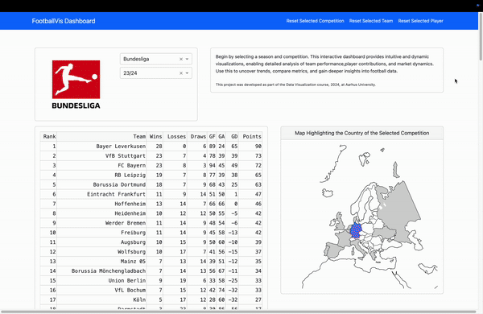

# Data Visualization Project
Project for the Data Visualization course at the Aarhus University. The project consists of the analysis of the dataset "Football Data from Transfermarkt" available on Kaggle.
https://www.kaggle.com/datasets/davidcariboo/player-scores
Version 492 (14.10.2024)

This project uses plotly + dash for the visualization.




## Project setup
#### Prerequisites
- Python 3.12
- pip (Python package manager)
#### Install dependencies
```sh
pip install -r requirements.txt
```
#### Run the project
```sh
python app.py
```

## Dockerfile
A dockerfile is provided to run the project in a container.

